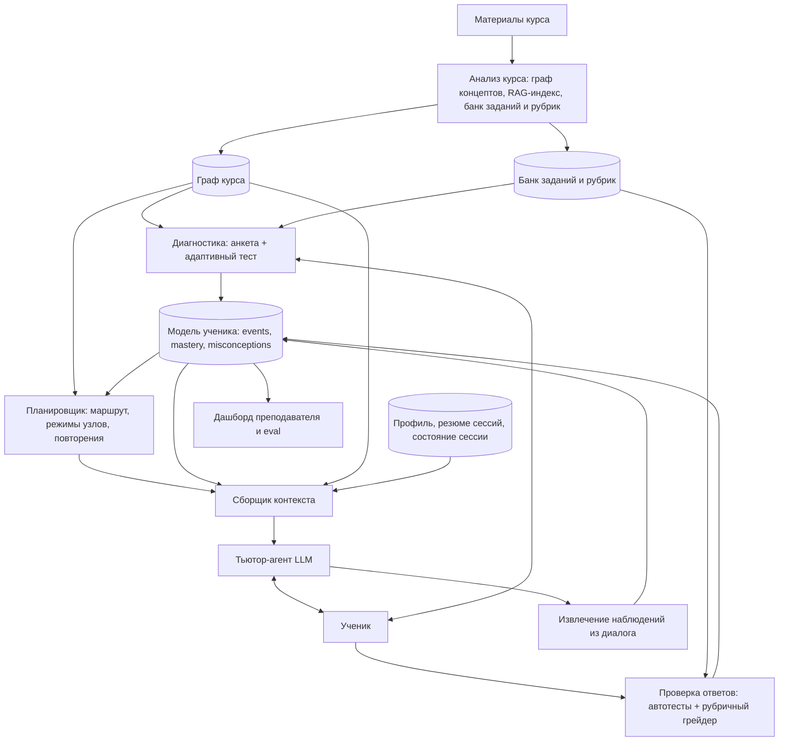

# LLM-тьютор для курса: архитектура и рекомендуемые решения

Сводка обсуждения (версия 2, после адверсариального ревью). Пример курса: Машинное обучение.

---

## 0. Как читать этот документ: степень уверенности

Не все рекомендации одинаково надёжны. В тексте ниже стоят пометки:

| Метка | Значение |
|---|---|
| **[база]** | Устоявшаяся практика из литературы по интеллектуальным обучающим системам (ITS) и оценке моделей |
| **[эвристика]** | Разумное инженерное решение, но конкретные значения порогов и весов нужно подбирать на данных |
| **[гипотеза]** | Идея, которую нужно проверить на пилоте, прежде чем строить на ней что-то ещё |

Все числовые пороги в тексте (проценты, количество вопросов, лимиты времени) это **стартовые значения для настройки**, а не результаты исследований, если явно не указан источник.

---

## 1. Главные принципы

1. **LLM это интерфейс и генератор, а не источник истины.** Состояние ученика, планирование и проверка живут в БД и обычном коде. LLM объясняет, общается, извлекает структурированные данные и оценивает открытые ответы по рубрикам. **[база]**
2. **Курс неизменен, меняется маршрут.** Персонализация это выбор режима, порядка и времени для каждого узла, а не переписывание материалов. **[эвристика]**
3. **Источник истины для ученика это журнал событий.** Оценки владения производные, пересчитываются обычной моделью, а не пишутся LLM напрямую. **[база]**
4. **Объективное важнее субъективного.** Автотесты > вопросы с проверяемым ответом > рубрики LLM > впечатление из диалога > самооценка. **[база]**
5. **Контекст собирается заново на каждый ход** из хранилища, а не тащится как история чата. **[база]**
6. **Начинать с простого и прозрачного.** Счётчики и правила на старте, сложные модели после появления реальных данных. **[эвристика]**
7. **Польза не доказана, пока не измерена.** Адаптивный маршрут и «умный» тьютор могут нравиться, но не учить лучше. Нужны pre/post-тесты и сравнение с базовым вариантом. **[база]**

---

## 2. Общая архитектура



| Слой | Что делает | Кто исполняет |
|---|---|---|
| Анализ курса | Граф концептов, привязка материалов, заданий и рубрик | LLM + ручная проверка |
| Модель ученика | Оценки владения, забывание, заблуждения | Код |
| Диагностика | Быстрое заполнение модели | Код + LLM для генерации вопросов |
| Планировщик | Маршрут и расписание | Код |
| Тьютор | Диалог, подсказки, мотивация | LLM |
| Грейдер | Проверка ответов | Автотесты + LLM по рубрике |
| Память | Состояние, резюме, профиль | БД + LLM для суммаризации |

---

## 3. Граф знаний курса

**Что это.** Граф концептов: узлы (темы), типизированные рёбра («требует», «часть», «ведёт к»), атрибуты (сложность, время, источник).

**Как строить (рекомендуется гибрид) [эвристика].**
1. LLM читает материалы, выделяет концепты, пререквизиты, цели обучения, сложность. Дополнительно используйте оглавления учебников и силлабусы как внешнюю опору.
2. Каждый концепт привязывается к чанкам материалов, заданиям, рубрикам и диагностическим вопросам.
3. Преподаватель (или вы) проверяет и правит граф. LLM особенно часто ошибается в **направлении и силе** пререквизитов, а ошибки здесь тянутся через всю систему.
4. Позже граф можно проверять данными: если ученики систематически решают тему B, не освоив A, значит, связь A→B слабее, чем в графе.

**Практические решения.**
- Формат: граф пререквизитов, как правило DAG. Для сотен узлов хватит таблицы рёбер в SQLite/Postgres и NetworkX. Neo4j нужен только для больших графов.
- **Жёсткие и мягкие пререквизиты.** Различайте «без этого нельзя» и «желательно знать». Иначе планировщик будет блокировать то, что на самом деле можно изучать параллельно. Храните тип и вес ребра.
- Проверка на циклы при каждом изменении графа (реальные зависимости в предметной области иногда взаимные; такие случаи разрешаются вручную через разбиение узла).
- **Гранулярность**: узел должен проверяться 3-5 вопросами. «Нейросети» слишком крупно, «производная сигмоиды» слишком мелко.
- Стабильные id концептов, чтобы пережить обновление курса.
- GraphRAG можно добавить позже для вопросов, связывающих несколько тем. **[гипотеза]**

---

## 4. Модель ученика (оверлей поверх графа курса)

Отдельный граф не строится. Граф курса получает **слой данных об ученике**.

**Хранится для каждого узла:**
- оценка владения и её неопределённость (различать «не проверяли» и «проверяли, не знает»)
- время последнего контакта, дата следующего повторения
- история свидетельств
- известные заблуждения (узлы-заблуждения, привязанные к концептам)
- узлы вне курса, если ученик показал знания, которых в графе нет

**Источники свидетельств (от надёжных к слабым):**
1. Автотесты и код-задания
2. Вопросы с проверяемым ответом
3. Открытые ответы, оценённые по рубрике
4. Наблюдения из диалога (малый вес)
5. Самооценка (минимальный вес)

### Как считать оценки

LLM **не** выдаёт «мастерство 0.8». Она выдаёт **структурированное событие**: концепт, тип свидетельства, результат, цитата-основание, уверенность. Число пересчитывает обычная модель.

**Рекомендуемый старт: Beta-счётчик на концепт [эвристика].**
- Для каждого концепта хранятся α и β (псевдо-счётчики успехов и неудач) с весами по типу свидетельства.
- Оценка = α / (α + β), а **неопределённость получается естественно** из ширины апостериорного распределения. Начальный априор Beta(1,1) означает «не знаем».
- Забывание: со временем α и β уменьшаются к априору, и неопределённость растёт.
- Прозрачно, легко отлаживать, не требует калибровки сложных параметров.

**Когда переходить к более сложным моделям [база, с оговорками].**
- **BKT** предполагает один навык на задание и даёт вероятность, но **не даёт неопределённость**. Если у заданий разметка `concept_weights` (несколько концептов), BKT напрямую не применим. Для многонавыковых заданий используют PFA, DAS3H, многомерный IRT или явное распределение «вины» по весам.
- **Elo/IRT-подобные** модели подходят, когда накоплено достаточно ответов, чтобы оценить сложность заданий.
- **FSRS** создан для карточек (вспоминание фактов). Для концептуальных и процедурных навыков (понимание bias-variance, написание цикла обучения) его применимость ограничена: используйте как основу для расписания повторений фактических знаний, а для остального задавайте интервалы эвристикой.
- Любая модель требует калибровки на реальных данных. Первое время не строить на ней жёсткие решения.

### Распространение по графу [эвристика]

- Успех на сложной теме слегка поднимает пререквизиты (идея из теории пространств знаний: решил продвинутое, значит, вероятно, знает базовое).
- Провал помечает «подозрительными» вероятных виновников (идём по рёбрам назад), но **не понижает их оценку жёстко**: ошибка могла быть невнимательностью.
- Затухание по расстоянию и малый вес, чтобы одна случайная ошибка не обрушила полграфа.
- Риск: ученик может решать задачи по шаблону без понимания базы. Поэтому распространённые значения всегда остаются «неподтверждёнными» (повышенная неопределённость), пока базовые узлы не проверены напрямую.

### Obsidian

Годится как представление, не как хранилище. Схема: БД (SQLite/Postgres) является источником истины, а vault генерируется односторонне (БД → Obsidian) для просмотра: заметка на концепт, YAML с метриками, вики-ссылки, свидетельства и заблуждения. Конспекты ученика можно читать обратно как слабый источник свидетельств, но не давать им напрямую менять оценки. В vault попадают персональные данные, поэтому доступ к нему защищается так же, как к БД.

### Минимальные таблицы

```
concepts(id, name, difficulty, ...)
edges(from_id, to_id, type, hard_or_soft, weight)
items(id, concept_weights JSON, difficulty, guess, slip)
events(ts, user_id, item_id, correct, hints, time_spent, source, weight)
mastery(user_id, concept_id, alpha, beta, last_seen, next_review)  -- оценка и неопределённость выводятся из alpha/beta
misconceptions(user_id, concept_id, text, evidence_count)
```

---

## 5. Создание модели ученика: три фазы

**Фаза 1. Холодный старт.**
- Короткая анкета (линал, матстат, Python, опыт, цель, время). Вес низкий, используется как априор.
- Импорт артефактов (резюме, GitHub, прошлые курсы), если есть. Тоже слабые свидетельства.
- По умолчанию: среднее значение с **большой неопределённостью**.

**Фаза 2. Адаптивная диагностика.**
1. Выбираем узлы с наибольшей неопределённостью и важностью для плана.
2. Выбираем вопрос из банка так, чтобы он был максимально информативным. Для чистой диагностики это вопросы со сложностью около текущей оценки (≈50% ожидаемого успеха; при выборе из вариантов с угадыванием оптимум смещается выше).
3. Обновляем узел и соседей по графу.
4. Останавливаемся по порогу неопределённости ключевых узлов или лимиту вопросов.

Стратегия «бинарного поиска по графу»: начинаем со средних тем. Уверенный ответ позволяет проверять выше, пререквизиты считаются вероятно освоенными (но не подтверждёнными). Провал означает спуск к пререквизитам.

Форматы: выбор из вариантов (дистракторы соответствуют типичным заблуждениям, есть «не знаю»), короткие задачи с автопроверкой, открытое объяснение для ключевых узлов. Учитывать guess и slip.

Практика [эвристика]:
- Ориентир для длины: порядка 15-30 вопросов на курс из десятков узлов, но это **оценка, не гарантия**. Реальное число зависит от размера графа, качества банка и порога остановки; проверяйте на пилоте.
- Разбить диагностику на 2-3 короткие сессии или встроить в первые занятия; подавать как «подбор маршрута», а не экзамен.
- **Проверка валидности диагностики**: сравнить предсказания модели с результатами реальных заданий через неделю. Если модель систематически завышает, диагностику надо перенастроить.

**Фаза 3. Непрерывное обновление.** Каждое действие в курсе корректирует модель. Новые узлы «вне курса» и заблуждения создаются динамически: заблуждение попадает в граф после нескольких подтверждений. Периодическая перекалибровка на «якорных» узлах.

---

## 6. Планировщик: индивидуальный маршрут

### 6.1 Режимы узла

| Режим | Когда |
|---|---|
| Пропустить | Высокое владение с малой неопределённостью, подтверждено прямой проверкой |
| Проверить и идти дальше | Вероятно знает, нужна контрольная задача |
| Сжатый проход | Среднее или неопределённое владение |
| Полный проход | Низкое владение |
| Усиленный проход | Застрял: другие объяснения, больше практики, разбор заблуждений |
| Вернуться к пререквизиту | Причина ошибок ниже по графу |
| Повторение | Просрочено по кривой забывания |

Критерий завершения: **стабильное решение N задач без подсказок или порог оценки с малой неопределённостью**, а не «прочитал». Время варьируется, планка освоения фиксирована (mastery learning). [база]

**Wheel spinning.** В литературе по ITS описан случай, когда ученик много практикуется и не приближается к освоению навыка. Такие случаи нужно ловить явно: если потрачено заметно больше планового времени (например, вдвое, стартовое значение) без роста оценки, система не продолжает давить, а меняет стратегию (другое объяснение, возврат к пререквизиту, предложение обратиться к человеку). [эвристика]

### 6.2 Три уровня планирования

1. **Стратегический** (после диагностики, раз в несколько дней): маршрут по подграфу цели; время узла = базовая длительность × коэффициент слабости × личная скорость.
2. **Тактический** (каждая сессия): кандидаты это узлы «границы готовности»; выбор по приоритету; повторения в начале и в конце.
3. **Реактивный** (внутри сессии): серия ошибок запускает усиленный проход или возврат; быстрое решение ведёт к более сложной задаче или пропуску; усталость вызывает смену формата или паузу.

Не пересчитывать весь план после каждого ответа: нужны недельные «якоря» и порог изменений, чтобы план не дёргался.

### 6.3 Функция приоритета [эвристика]

```
priority(node) =
    w1 * важность          # сколько зависимых узлов открывает, нужен ли цели
  + w2 * пробел            # 1 - оценка владения с поправкой на неопределённость
  + w3 * готовность        # пререквизиты освоены (иначе штраф/исключение)
  + w4 * срочность_повторения
  - w5 * стоимость         # ожидаемое время
  - w6 * штраф_за_недавний_провал
```

- **Нормализуйте все слагаемые к одной шкале** (например, 0..1), иначе веса несравнимы.
- Следите за двойным учётом (низкая оценка одновременно повышает «пробел» и «срочность повторения»).
- Для обучения целимся в вероятность успеха 60-80% («зона ближайшего развития»). Это **не противоречит** диагностике на ≈50%: у диагностики цель максимум информации, у обучения максимум пользы при сохранении мотивации.
- Веса сначала подбираются вручную и проверяются на симуляции, затем калибруются по логам.

### 6.4 Триггеры пересчёта

Провал контрольной, неожиданно уверенное решение, долгий перерыв (размыть оценки и сделать вводный повтор), смена цели или дедлайна, накопление отставания. После пересчёта сравнить новый план со старым и оставить старый, если различия малы.

### 6.5 Роль LLM здесь

Озвучивает план и объясняет «почему сегодня это», принимает пожелания и превращает их в **ограничения или веса** планировщика, а не в произвольные изменения плана.

---

## 7. Тьютор-агент

- **Педагогическая политика** в системном промпте: сократовский диалог, **лестница подсказок** (намёк → наводящий вопрос → частичное решение → разбор), проверка понимания через задачу, а не «понятно?».
- RAG по материалам курса с цитированием; честное «этого нет в курсе».
- Проактивность осмысленная: повторение прошлого в начале сессии, чек-ин по поводу, возможность отключить.
- **Устойчивость к нажиму**: модель склонна сдаваться и выдавать ответ. Политику «не отдавать решение сразу» нужно тестировать специально (сценарии: ученик настаивает, давит эмоционально, притворяется преподавателем).
- **Защита от «игры с системой» (gaming the system)**: известное поведение в ITS, когда ученик быстро перебирает подсказки или варианты, не думая. Сигналы: подозрительно малое время на шаг, пролистывание лестницы подсказок до конца, серии случайных попыток. Реакция: в событиях такие попытки имеют сниженный вес, тьютор мягко возвращает к осмысленной работе.
- **Вердикт отделён от подачи**: вердикт приходит из грейдера, тьютор выбирает тон, но не смягчает сути.
- Генерируемые задания проходят валидацию: эталонное решение запускается, второй вызов LLM решает независимо, ответы сверяются; у каждого задания разметка концептов и весов.

---

## 8. Контекст и память

LLM не помнит между вызовами. Нужны **хранилище состояния** и **сборщик контекста**. [база]

### 8.1 Слои памяти

| Слой | Содержимое | Обновление | В промпт |
|---|---|---|---|
| Структурированное состояние | mastery, events, misconceptions, маршрут | код | срез по текущей теме и соседям |
| Состояние сессии | текущий узел, режим, ступень подсказок, задание, попытки | JSON после каждого хода | всегда |
| Резюме сессий | 100-200 слов: что разбирали, ошибки, договорённости | LLM в конце сессии | 2-3 релевантных |
| Профиль и предпочтения | цель, дедлайны, стиль, контекст | по триггерам | кратко, почти всегда |
| Материалы курса | чанки для RAG | статично | 2-4 по узлу |
| Сырой лог | весь диалог | постоянно | только хвост (6-10 реплик) |

### 8.2 Пакет контекста на ход

```
[Системные правила]
[Профиль]
[Состояние сессии]
[Срез модели ученика: оценка узла и пререквизитов, заблуждения, последние ошибки]
[Резюме прошлых сессий]
[Материал курса]
[Хвост диалога]
[Сообщение ученика]
```

Бюджет токенов распределён заранее (пример: правила 15%, ученик 20%, материал 25%, диалог 30%, запас; значения иллюстративны). При нехватке места сначала сокращаются диалог и материал. Если вопрос не по текущему узлу, сначала определяется концепт вопроса и подтягивается срез именно по нему.

### 8.3 Цикл обновления

- **После хода:** событие в журнал, обновление оценок и состояния сессии (код).
- **По триггерам:** отдельный вызов LLM извлекает структурированное наблюдение (концепт, верно, неверно, формулировка заблуждения, цитата, уверенность) со слабым весом; явные факты уходят в профиль.
- **В конце сессии:** резюме, закрытие состояния, пересчёт плана.
- **Периодически:** консолидация (слияние дублей заблуждений, сжатие старых резюме, удаление устаревшего). Иерархия: лог → резюме сессий → резюме периода → профиль.

«Что мы проходили» берётся из `events` и резюме, а не из «памяти» модели. Тогда тьютор может сослаться на конкретный урок и пример. Оценки знаний **не извлекаются из резюме**, они живут только в модели ученика.

### 8.4 Хранилище

Postgres или SQLite + векторный индекс (pgvector) для резюме и материалов:

```
learners, facts(key, value, source, ts, confidence),
sessions(state JSON), messages, session_summaries,
+ events, mastery, misconceptions
```

Модуль `build_context(...)` собирает пакет, модуль `post_turn()` пишет события и запускает извлечение наблюдений. Записи событий атомарные, производное пересчитывается из журнала.

---

## 9. Объективная оценка ответов

### 9.1 Типичные искажения LLM-судьи

Снисходительность и сикофантство, предпочтение длинных и уверенных ответов, эффект ореола, нестабильность между прогонами, якорение на мнении ученика, «размытая» шкала 1-10, а также занижение из-за придирок к формулировкам.

### 9.2 Уровни защиты

1. **Всё проверяемое проверять без LLM:** автотесты кода (nbgrader/Jupyter, песочница), допуск по числам, точное сравнение выбора, SymPy для формул. [база]
2. **Рубрика из атомарных бинарных критериев** вместо общей оценки; для каждого критерия дословная цитата из ответа; критерии на типичные заблуждения; итог считается кодом. Как правило, повышает согласованность с человеком, но эффект нужно измерять на ваших данных. [эвристика]
3. **Эталон и разбор до вердикта.** Нет цитаты, значит, критерий не засчитан. **Проверять код-ом, что цитата действительно является подстрокой ответа ученика** (иначе модель может «придумать» подтверждение).
4. **Калибровочные примеры** (засчитано, пограничный, не засчитано) в промпте.
5. **Изоляция грейдера:** отдельный вызов, без истории чата, без уровня ученика и его уверенности. Ответ передаётся как данные в разделителях с инструкцией игнорировать команды внутри. **Разделители не дают полной защиты от prompt injection**, поэтому добавляются: строгая схема выхода (JSON с фиксированными полями), проверка цитат кодом, ограничение полномочий грейдера (его вердикт для открытых ответов даёт события с ограниченным весом, и ни одно «высокоставочное» решение, например пропуск темы, не принимается только по нему), мониторинг аномально высоких оценок.
6. **Устойчивость к шуму:** низкая температура (учтите: она не гарантирует детерминизм, а у части моделей и режимов её нельзя задавать), 3-5 прогонов с голосованием на важных ответах; при расхождении «неуверенно» (уточняющий вопрос, сильная модель или человек). Ансамбль разных моделей снижает специфические смещения одной модели, в том числе когда эталоны сгенерированы той же моделью, что оценивает.
7. **Асимметрия ошибок:** ложное «засчитано» обычно хуже (ученик уходит с заблуждением), но ложное «не засчитано» бьёт по мотивации и доверию. Пограничные случаи превращать в уточняющий вопрос, а не в вердикт, и измерять обе ошибки отдельно.

### 9.3 Как измерять

- **Золотой набор** 100-300 ответов, размеченных преподавателем (желательно двумя людьми).
- Метрики: kappa / quadratic weighted kappa против человека (ориентир: близко к согласию между самими преподавателями), матрица ошибок по направлениям, смещение средней оценки, стабильность между прогонами.
- **Доверительные интервалы**: на 50-100 ответах оценки kappa очень шумные, а по отдельным критериям ещё хуже. Такой набор годится, чтобы ловить грубые ошибки, а не утверждать «грейдер откалиброван». Набор нужно наращивать на реальных данных.
- Регрессионный прогон **при каждом изменении промпта или модели**; отдельный тестовый набор против переобучения под золотой.
- Стресс-тесты: верный ответ в плохом стиле, неверный в блестящем, «я уверен, что прав», инъекция.
- В продакшене: выборочная проверка человеком (≈5% и все пограничные), мониторинг дрейфа.

### 9.4 Готовые инструменты (актуальность перепроверить)

| Задача | Инструменты |
|---|---|
| Прогоны и метрики судьи, регрессия | DeepEval, promptfoo, OpenAI Evals, Inspect, LangSmith (Ragas ориентирован на оценку RAG-пайплайнов, а не на калибровку судьи) |
| Рубричная оценка | подход G-Eval |
| Локальный судья | Prometheus / Prometheus 2 (требует проверки на вашей области) |
| Код-задания | nbgrader, Gradescope, Codio |
| Бенчмарки коротких ответов | ASAP-SAS, SemEval-2013 (SciEntsBank/Beetle) |

Рубричный грейдер под свой курс пишется самостоятельно, фреймворки нужны для измерений.

---

## 10. Что уже существует и что говорят исследования (актуальное состояние перепроверить)

**Продукты и проекты**
- **Khanmigo** (Khan Academy): сократовский LLM-тьютор.
- **CS50 Duck / cs50.ai**: тьютор для курса программирования, не выдаёт готовый код.
- **Учебные режимы:** ChatGPT Study Mode, Gemini Guided Learning (LearnLM), режимы обучения у Claude.
- **Duolingo Max, Coursera Coach**: LLM внутри существующих курсов.
- **Классические ITS без LLM** (у них отработаны модель ученика, планирование, knowledge tracing): ALEKS (knowledge space theory), Carnegie Learning/MATHia, ASSISTments, Squirrel AI.
- **Слои памяти для агентов:** Mem0, Zep/Graphiti. Подходят для свободных наблюдений, но не заменяют структурированную модель владения.

**Исследования (с оговорками)**
- **Bastani et al., «Generative AI Can Harm Learning»** (препринт 2024): рандомизированный эксперимент, почти 1000 старшеклассников в Турции, математика, GPT-4. Обычный чат: +48% на практике, но **−17%** на последующем экзамене без ИИ. Версия с педагогическими ограничениями (GPT Tutor): +127% на практике, а на экзамене **разницы с контролем не было**. То есть защитный тьютор в основном **не навредил**, а не улучшил итоговое обучение. Это важно: цель вашей системы показать именно прирост на экзамене без ИИ, а не рост результатов «с подсказками».
- **Kestin et al.** (Гарвард, физика, препринт 2024, публикация 2025): тщательно настроенный ИИ-тьютор дал больший прирост знаний, чем очное активное обучение. Это один курс и одна аудитория, обобщение на другие предметы не доказано.
- **«2 sigma» Блума (1984)** часто цитируют как мотивацию, но величина эффекта завышена. Метаанализ VanLehn (2011): человеческое репетиторство d ≈ 0.79, интеллектуальные обучающие системы d ≈ 0.76. Эффект большой, но около одного стандартного отклонения, а не двух. Другие метаанализы ITS дают меньшие значения, и результат сильно зависит от предмета и внедрения.
- Работы по LearnLM (Google).

---

## 11. Главные подводные камни (сводка)

**Педагогические**
- Студент перекладывает мышление на LLM; нужна политика подсказок и её тестирование.
- «Игра с системой» (gaming the system) и wheel spinning: нужны сигналы по времени и подсказкам и стратегия выхода.
- Сикофантство: оценку привязывать к тестам и рубрикам.
- Illusion of knowing: мастерство мерить решением задач, а не ощущением понимания. В эксперименте Bastani ученики с обычным GPT оценивали своё обучение так же, как контроль, хотя выполняли экзамен хуже.
- Мотивация: шаблонные чек-ины раздражают, слабое место нельзя бесконечно «долбить», чередовать с посильным.
- Метрика вместо понимания: разнообразные задачи, перенос на новые условия.

**Технические**
- Галлюцинации в объяснениях (опасно в ML): RAG с цитатами, проверка ключевых утверждений.
- Качество графа концептов, гранулярность, жёсткие/мягкие пререквизиты.
- Совместимость модели оценки и разметки заданий (многонавыковые задания и BKT).
- Калибровка модели ученика; холодный старт параметров (guess/slip, сложности, веса приоритета).
- Банк вопросов как узкое место; валидация сгенерированных заданий.
- Prompt injection: в ответах ученика (грейдер, тьютор) и в самих материалах курса (если они содержат недоверенный контент, например чужие конспекты или веб-страницы).
- Порча и дрейф резюме при сжатии; ложные факты в профиле; противоречия (свежие объективные данные побеждают старые заявления).
- Рассинхрон состояний, конкурентные сессии, версии курса, дрейф версий модели провайдера.
- Стоимость и задержки при множественных вызовах.

**Организационные и правовые**
- Доказать пользу: pre/post-тесты, сравнение адаптивного маршрута с линейным.
- Приватность: просмотр, исправление, удаление, минимизация (GDPR при EU-аудитории). Профиль ученика содержит чувствительные данные (трудности, эмоции).
- Если система будет работать с аудиторией в ЕС: образовательные системы, оценивающие результаты обучения или управляющие процессом обучения, относятся к категории высокого риска по EU AI Act. Требования и сроки применения нужно уточнить на момент запуска.
- Оценка с юридическим весом не может опираться только на ИИ.
- Агрессивные пропуски тем: только с подтверждающей контрольной.

---

## 12. План реализации

**MVP (один курс, 1-2 пользователя)**
1. Граф курса на 30-50 узлов, проверен вручную; DAG в SQLite, у рёбер тип жёсткий/мягкий.
2. Банк вопросов: 3-5 на узел (часть автопроверяемых), с валидацией.
3. Анкета + короткая адаптивная диагностика по правилу «узел с наименьшими данными и высоким приоритетом».
4. Простая модель ученика: Beta-счётчики с весами по источнику и затуханием, распространение на прямые пререквизиты.
5. Планировщик: `ready_nodes()` + функция приоритета + режимы узла по порогам.
6. Тьютор: RAG + лестница подсказок + состояние сессии в JSON + резюме в конце сессии.
7. Автотесты для кода, рубричный грейдер для открытых ответов (проверка цитат кодом), золотой набор 50-100 ответов как грубый фильтр ошибок.
8. Логирование всего, включая время на шаг и использование подсказок.
9. Заранее продуманный способ сравнения (хотя бы pre/post-тест), иначе пользу не измерить.

**Этап 2**
- Выбор модели оценки по данным (BKT для однонавыковых заданий, PFA/DAS3H/IRT для многонавыковых, FSRS или эвристика для повторений), калибровка весов по логам.
- Извлечение наблюдений из диалога, узлы-заблуждения, консолидация памяти.
- Векторный поиск по резюме, профиль фактов, Obsidian-vault как представление.
- Ансамбль и голосование для грейдера, регрессионные прогоны в DeepEval/promptfoo, рост золотого набора.
- Детектор «игры с системой» и wheel spinning.
- Дашборд преподавателя (где застревают).

**Этап 3**
- Оценка эффективности (pre/post, контрольная группа, экзамен без ИИ).
- Оптимизация расписания под ограничения, GraphRAG, возможно RL на реальных данных.
- Приватность, экспорт и удаление данных, версионирование курса, правовая проверка.

---

## 13. Открытые темы для следующих шагов

- Как тьютор ведёт сессию внутри узла: лестница подсказок, устойчивость к нажиму, переходы между режимами.
- Конкретная схема извлечения наблюдений из диалога без завышения понимания.
- Как LLM извлекает граф концептов из материалов и как его валидировать.
- Дизайн эксперимента для проверки эффективности.
